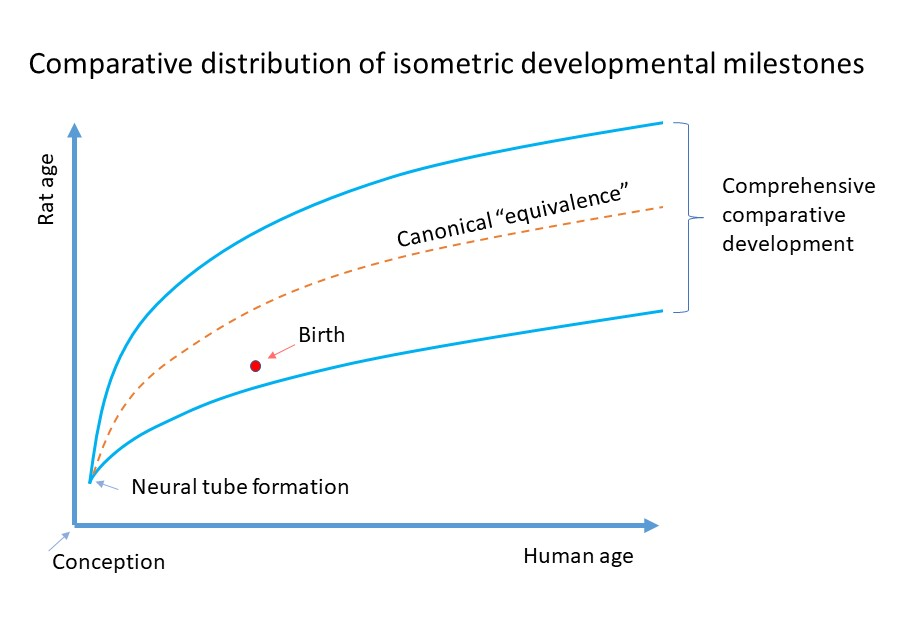

## Comparative development of humans and Rats.

This website aims to assist researchers in determining the optimal age of animal models throughout development by providing a comprehensive overview of the similarities and differences in the developmental trajectory of rats and humans.


<a href="https://vazquez-borsetti.github.io/rat-and-human-comparative-development/grafico1.html">View the graph on a new window</a>

### How to interpret this graph?

Each dot represents a homologous developmental milestone. Hovering the mouse over the dot provides more information about the event. The graph can also be amplified to have a more precise view of the pattern of events.
 The vertical and horizontal black lines represent the birth of each species.
The red and green lines encompass 90% (95% to 5% quantiles) of developmental milestones. These limits were derived by fitting the data to quantile regressions. This method enables robust population estimations as long as the sample is representative of the population.
 (<a href="https://doi.org/10.1101/2023.04.11.536227">see</a>).

### Choosing your model:

When selecting the age of animal models, it's important to note that the patterns of development diverge as development progresses. To choose your model, consider the most important milestones that could affect your research. For instance, if you are studying perinatal asphyxia, birth may play a crucial role in the physiopathology of the process. You can also utilize different ages within reasonable margins, as proposed in this analysis, and validate your model based on its similarity to the pathophysiology observed in patients.

If the information provided on this website was helpful for your research, please consider citing:

Divergent pattern of development in rats and humans.

Wanda campos, Tomas Iorri, Antonella Presti, Rafael Grimson, Pablo Vázquez-Borsetti
bioRxiv 2023.04.11.536227; doi: https://doi.org/10.1101/2023.04.11.536227 

This problem has also been discussed in another publication:

Transition to extrauterine life and the modeling of perinatal asphyxia in rats.

Ortiz M, Loidl F, Vázquez-Borsetti P. WIREs Mech Dis. 2022 Sep;14(5):e1568. Epub 2022 Jun 16. PMID: 35712761.
(<a href="https://doi.org/10.1002/wsbm.1568">https://doi.org/10.1002/wsbm.1568</a>)

<meta property="og:image" content="./scheme.jpg" />
<meta property="og:image:type" content="image/jpeg" >
<meta property="og:image:width" content="917" >
<meta property="og:image:height" content="624" >
